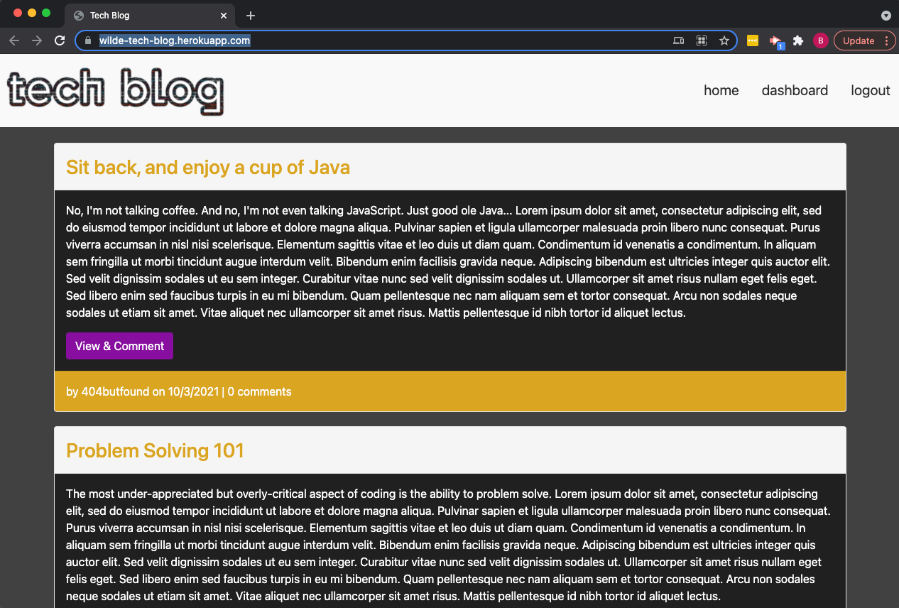
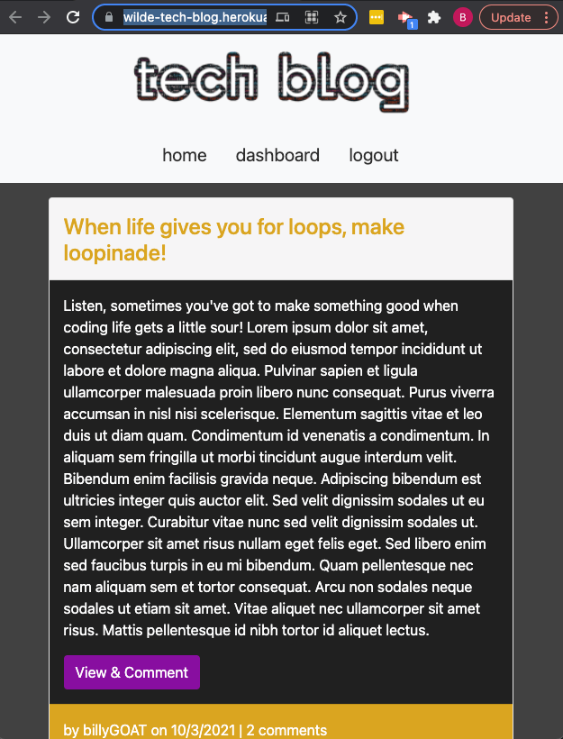
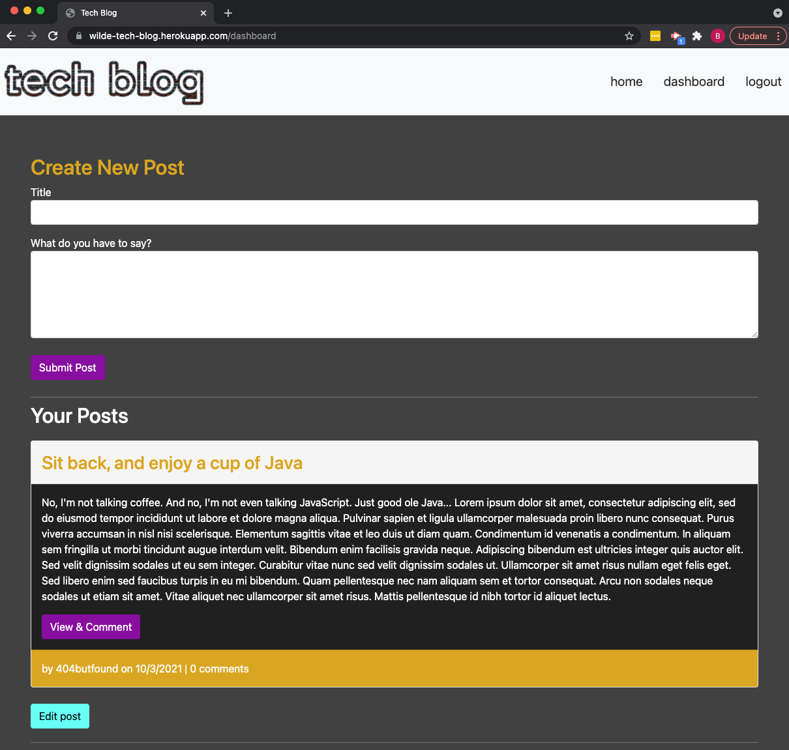
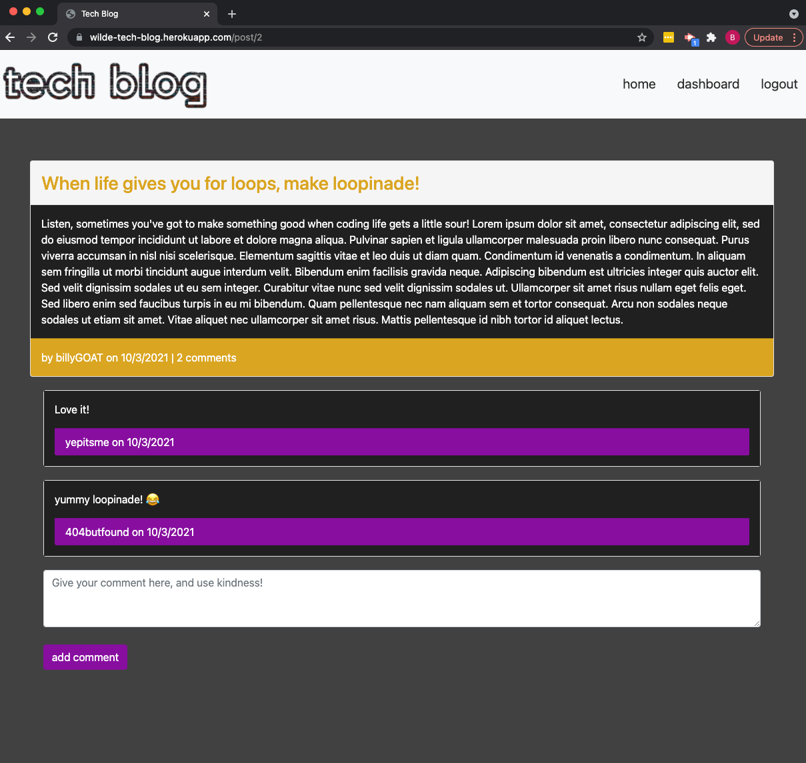

# Tech-Blog

https://wilde-tech-blog.herokuapp.com/

## Description
This application provides an environment for users to create blog posts to encourage others in the tech community. In creating this application, the following technologies were used:
- HTML/CSS
- Bootstrap
- JavaScript
- Node.js (with bcrypt, connect-session-sequelize, dotenv, express-handlebars, express session, and mysql2 packages in addition to others listed as primary technologies)
- Express
- MySQL/Sequelize
- Handlebars.js

## Table of Contents
* [Installation](#installation)
* [Usage](#usage)
* [Credits](#credits)
* [License](#license)
* [Contributing](#contributing)
* [Tests](#tests)
* [Questions](#questions)

## Installation
To interact with this application without running your own server on your local machine, use the deployed link, signing in to have more interaction. 

For personal/local use, use the command 'git clone' in your command line with the link of this repo while navigated to your desired directory to copy this repo to your machine, run 'npm install' or 'npm i' in your command line in the root folder of this application to install dependencies required (bcrypt, connect-session-sequelize, dotenv, express, express-handlebars, express-session, handlebars, mysql2, sequelize). (note: it is not recommended to update the version of these dependencies, in order to ensure maximum compatability)

## Usage
1. To use your own database and server, create a .env file to store and protect your credentials. reference the config/connection.js set up for variables to include in your env file.
2. To avoid typing in blogposts and users from the front end, use these steps to populate the tech blog database.
    * In your command line while in the root folder of the application, login to the mysql shell using the command 'mysql -u root -p'. If you are using a different mysql user specify that in place of root. You'll insert your password after executing this command.
    * Run 'SOURCE db/db.sql' to start with a fresh database called tech_blog_db. then exit the mysql shell using 'quit;'
    * Add any data you'd like to the seeds.sql file.
    * Run 'npm start' to start the server and initialize the models for table data.
    * Use control-c to close the server, then 'mysql -u root -p' to login to mysql shell again. 
    * Run 'SOURCE db/seeds.sql' to seed your data. then quit; to close out of mysql shell.
    * Your data should now be populated in the database!
3. While still in the application root folder, run the command 'npm start' to initiate the application.
6. You can now login, comment, create and edit posts on the Tech Blog!

### Deployed link and Screenshots
(https://wilde-tech-blog.herokuapp.com/)

## Credits
The user guidelines and learning concepts for this project were given by Trilogy Education as a part of the University of Kansas Full Stack Web Developer Bootcamp. © 2021 Trilogy Education Services, LLC, a 2U, Inc. brand. Authorization and formatting helpers provided by Triology Edication. Remaining code original to Brian Wilde.

## License

### MIT LICENSE

Permission is hereby granted, free of charge, to any person obtaining a copy
of this software and associated documentation files (the "Software"), to deal
in the Software without restriction, including without limitation the rights
to use, copy, modify, merge, publish, distribute, sublicense, and/or sell
copies of the Software, and to permit persons to whom the Software is
furnished to do so, subject to the following conditions:

The above copyright notice and this permission notice shall be included in all
copies or substantial portions of the Software.

THE SOFTWARE IS PROVIDED "AS IS", WITHOUT WARRANTY OF ANY KIND, EXPRESS OR
IMPLIED, INCLUDING BUT NOT LIMITED TO THE WARRANTIES OF MERCHANTABILITY,
FITNESS FOR A PARTICULAR PURPOSE AND NONINFRINGEMENT. IN NO EVENT SHALL THE
AUTHORS OR COPYRIGHT HOLDERS BE LIABLE FOR ANY CLAIM, DAMAGES OR OTHER
LIABILITY, WHETHER IN AN ACTION OF CONTRACT, TORT OR OTHERWISE, ARISING FROM,
OUT OF OR IN CONNECTION WITH THE SOFTWARE OR THE USE OR OTHER DEALINGS IN THE
SOFTWARE.

## Contributing
No contributing guidelines currently

## Tests
No tests at this time

## Questions
You can find my GitHub profile at https://github.com/bgswilde
For any further questions, reach out to me via email at bgswilde@gmail.com.
